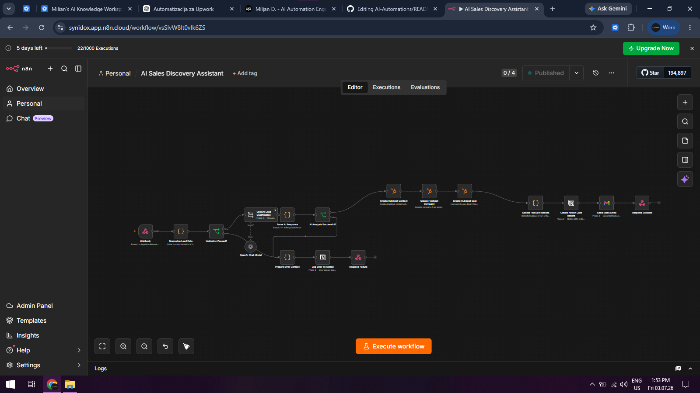
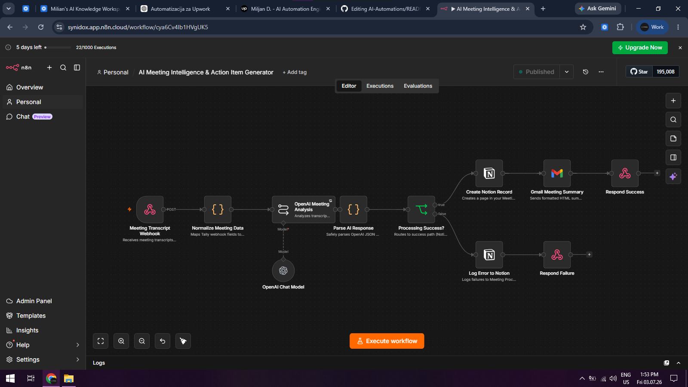
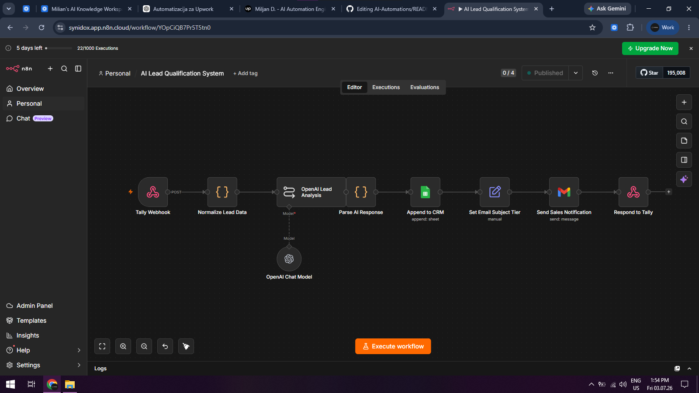
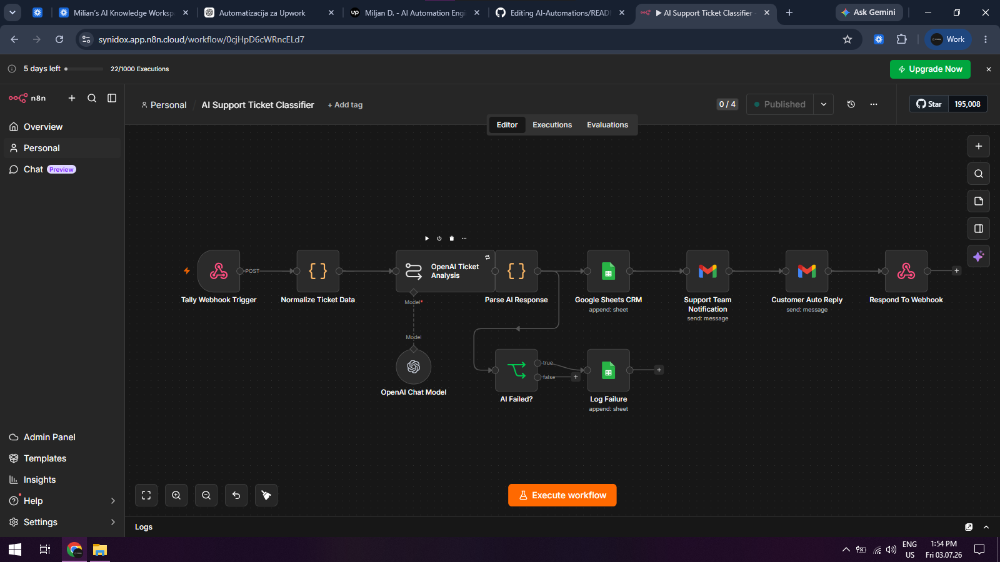

# 🤖 AI Automations Portfolio

A collection of AI-powered business automation workflows built with **OpenAI**, **n8n**, and modern business tools.

These automations eliminate repetitive tasks, improve business operations, and integrate AI directly into existing workflows using CRM systems, productivity tools, and email platforms.

---

# 🚀 AI Sales Discovery Assistant

### Overview

Automatically qualifies incoming sales leads using AI, creates CRM records, logs business data, and notifies the sales team without manual intervention.

### Features

- AI Lead Qualification
- Lead Validation
- HubSpot Contact Creation
- HubSpot Company Creation
- HubSpot Deal Creation
- Notion CRM Integration
- Gmail Sales Notification
- Error Handling & Logging

### Tech Stack

- OpenAI
- n8n
- HubSpot
- Notion
- Gmail
- Webhooks

🎥 **Demo Video**

(https://www.loom.com/share/ee3bd8ea3f20499c9638b9d1a11ed163)

---

# 📝 AI Meeting Intelligence & Action Item Generator

### Overview

Transforms meeting transcripts into structured summaries, extracts action items, documents outcomes, and automatically shares results with the team.

### Features

- AI Meeting Analysis
- Meeting Summary Generation
- Action Item Extraction
- Notion Documentation
- Gmail Meeting Summary
- Automatic Error Logging

### Tech Stack

- OpenAI
- n8n
- Notion
- Gmail
- Webhooks

🎥 **Demo Video**

(https://www.loom.com/share/7102595bacea4ff8acf0f1036ae76427)

---

# 📈 AI Lead Qualification System

### Overview

Evaluates incoming leads with AI, assigns qualification, stores them inside a CRM spreadsheet, and automatically notifies the sales team.

### Features

- AI Lead Analysis
- Lead Qualification
- Google Sheets CRM
- Automated Sales Notifications
- Email Subject Prioritization
- Webhook Integration

### Tech Stack

- OpenAI
- n8n
- Google Sheets
- Gmail
- Webhooks

🎥 **Demo Video**

(https://www.loom.com/share/20faae388bd8470bb309ca3dd41206cb)

---

# 🎫 AI Support Ticket Classifier

### Overview

Automatically classifies customer support tickets using AI, stores requests, notifies the support team, and sends an automated customer response.

### Features

- AI Ticket Classification
- Priority Detection
- Google Sheets Ticket Database
- Support Team Notification
- Automated Customer Reply
- Failure Logging

### Tech Stack

- OpenAI
- n8n
- Google Sheets
- Gmail
- Webhooks

🎥 **Demo Video**

(https://www.loom.com/share/27a9bea9815347209ccecd898150450b)

---

# 🛠 Technology Stack

### AI

- OpenAI GPT
- Prompt Engineering

### Automation

- n8n
- Webhooks
- REST APIs

### Business Integrations

- HubSpot
- Notion
- Google Sheets
- Gmail

### Workflow Design

- Business Process Automation
- CRM Automation
- Sales Automation
- Meeting Intelligence
- Customer Support Automation

---

# 📌 About

These projects demonstrate practical AI automation solutions designed to solve real business problems by combining Large Language Models with modern business tools and workflow automation platforms.

More AI-powered automation projects are currently in development.
